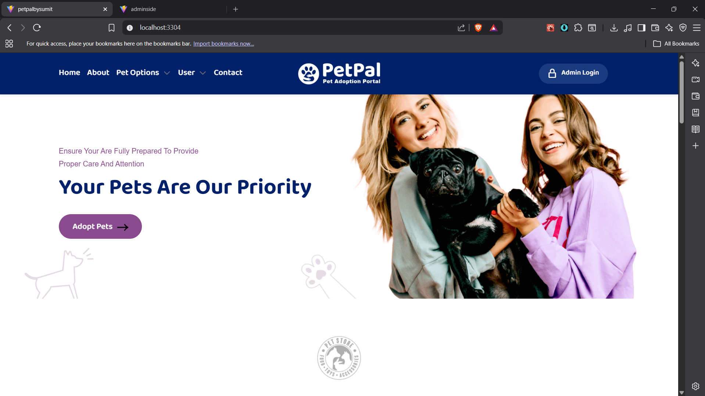
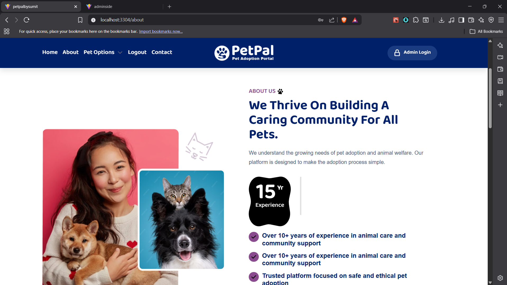
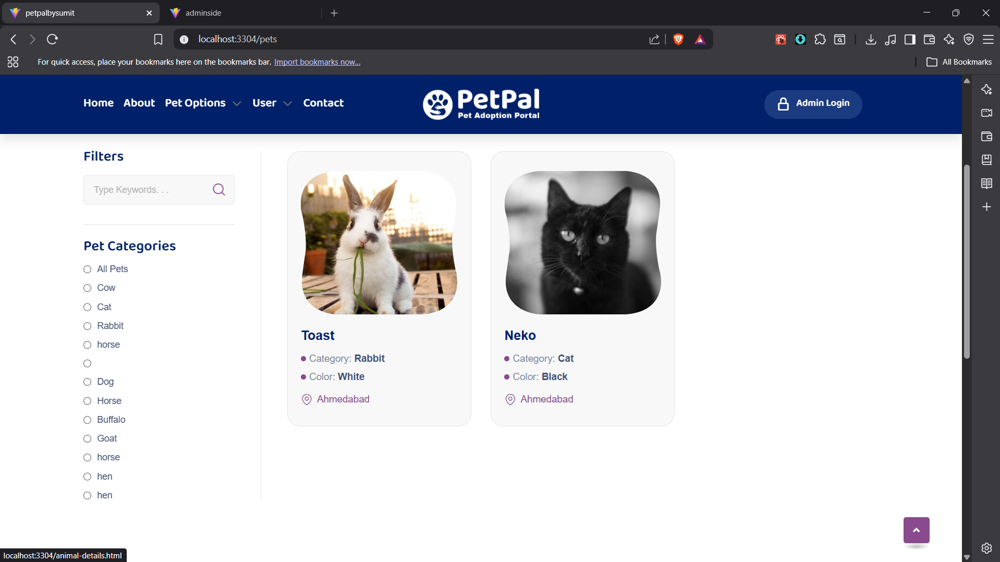
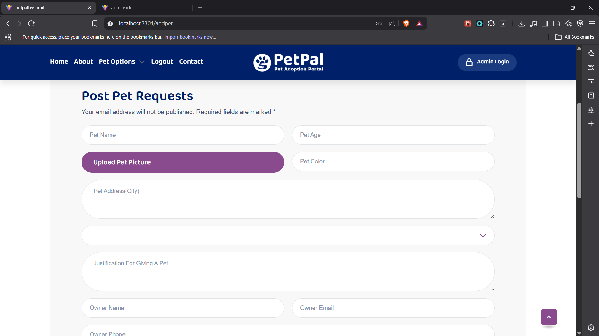
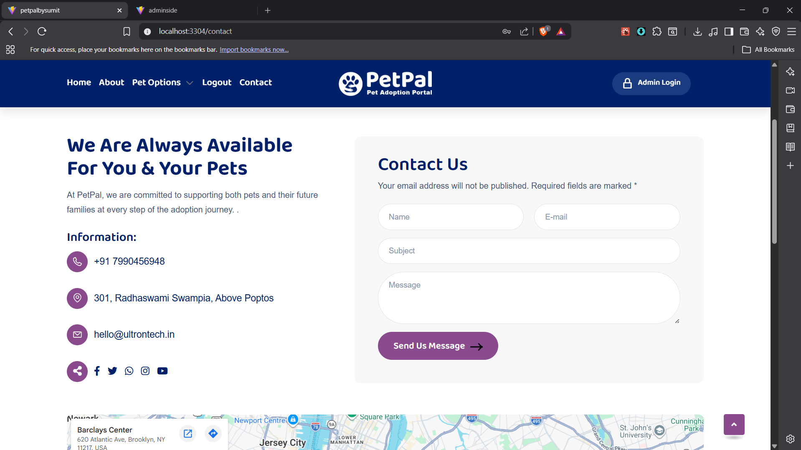
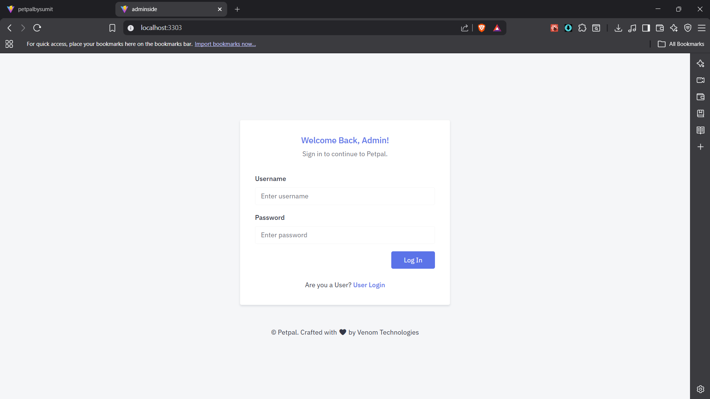
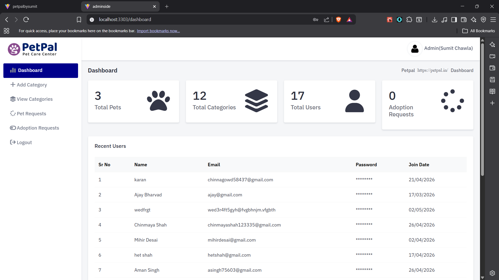

# 🐾 PetPal – Full Stack Pet Adoption Platform

PetPal is a full-stack pet adoption platform designed to connect pet owners, adopters, and administrators through a seamless and user-friendly web application.

The platform allows users to browse pets available for adoption, submit adoption requests, post pets for adoption, and communicate with the platform, while administrators can manage pets, categories, users, and adoption requests through a dedicated admin dashboard.

---

## 🚀 Features

### 👤 User Features

- User Registration & Authentication
- Browse Available Pets
- Search & Filter Pets by Category
- View Detailed Pet Profiles
- Submit Adoption Requests
- Post Pets for Adoption
- Contact Platform Administrators
- Responsive User Interface

### 🛠️ Admin Features

- Secure Admin Login
- Dashboard Analytics
- Manage Pet Categories
- Manage Pet Listings
- Manage Adoption Requests
- Manage Registered Users
- Monitor Platform Activity

---

## 🏗️ Tech Stack

### Frontend

- React.js
- JavaScript (ES6+)
- HTML5
- CSS3
- Bootstrap

### Backend

- Django
- Django REST Framework

### Database

- MySQL

### Authentication

- JWT Authentication

### API Communication

- REST APIs
- Axios

---

## 📸 Screenshots

### Homepage



### About Page



### Pet Listings



### Post Pet Request



### Contact Page



### Admin Login



### Admin Dashboard



---

## 📂 Project Structure

```text
PetPal-fullstack/
│
├── frontend/
│   ├── src/
│   ├── public/
│   ├── package.json
│   └── ...
│
├── backend/
│   ├── manage.py
│   ├── apps/
│   ├── requirements.txt
│   └── ...
│
├── screenshots/
│   ├── homepage.png
│   ├── about-page.png
│   ├── pet-listings.png
│   ├── post-pet-request.png
│   ├── contact-page.png
│   ├── admin-login.png
│   └── admin-dashboard.png
│
└── README.md
```

---

## ⚙️ Installation & Setup

### 1️⃣ Clone the Repository

```bash
git clone https://github.com/Kirtan1803/PetPal-fullstack.git
cd PetPal-fullstack
```

---

### 2️⃣ Backend Setup

```bash
cd backend

python -m venv venv

venv\Scripts\activate

pip install -r requirements.txt
```

Configure your database settings and run migrations:

```bash
python manage.py migrate
```

Start the Django server:

```bash
python manage.py runserver
```

Backend will run at:

```text
http://127.0.0.1:8000
```

---

### 3️⃣ Frontend Setup

```bash
cd frontend

npm install

npm run dev
```

Frontend will run at:

```text
http://localhost:5173
```

---

## 🔐 Authentication Workflow

### Users

- Register Account
- Login
- Browse Pets
- Submit Adoption Requests
- Post Pets for Adoption

### Administrators

- Secure Admin Login
- Manage Categories
- Manage Pets
- Review Adoption Requests
- Manage Users

---

## 🌟 Core Modules

### User Module

- Registration
- Login
- Profile Management

### Pet Management Module

- Add Pet
- View Pets
- Filter Pets
- Pet Details

### Adoption Module

- Adoption Requests
- Request Tracking

### Category Module

- Category Creation
- Category Management

### Admin Dashboard

- Statistics Overview
- User Management
- Pet Management
- Adoption Request Management

---

## 📈 Future Enhancements

- Real-Time Notifications
- AI-Based Pet Recommendations
- In-App Messaging
- Email Notifications
- Image Optimization
- Mobile Application Version

---

## 👨‍💻 Author

**Kirtan Tanti**

- GitHub: https://github.com/Kirtan1803
- LinkedIn: https://linkedin.com/in/kirtantanti
- Portfolio: https://kirtan-portfolio-pi.vercel.app/

---

## 📄 License

This project is developed for educational, learning, and portfolio purposes.
